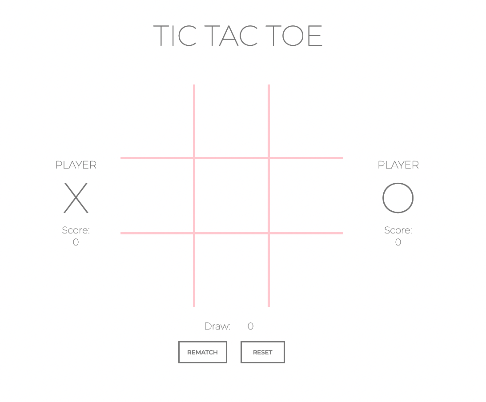

TIC TAC TOE
==========================

Classic game of tic tac toe. 

Try the game [here](https://kristabel-wong.github.io/miniature-eureka/)

 OR

 Try the cooler version [here](https://kristabel-wong.github.io/tic-tac-toe/) where you can play 2-player or against an easy computer AI

Instructions
--------------------------

1. Choose your player! The `X` and `O` tokens hover when you put your cursor over them. 
2. Place your tokens
3. Once you've won or lost, the winner is announced over the gameboard
4. Click `REMATCH` to play more rounds. The scores will be kept on either side. Draw scores below the board
5. Click `RESET` to reset the board and clear the scores.

Goodluck!

## Screenshot

